# Dreadlocks By Serah Msp1 

This is a site built for a real world business. Dreadlocks by Serah offer a mobile loctician service. The site gives visitors and users an overview of the services offered and plenty of opportunity to make contact. The site also has an FAQ section to cover the most common queries and A gallery to show case previous work. 
## [View Live Project here](https://jaycode88.github.io/msp-1/)

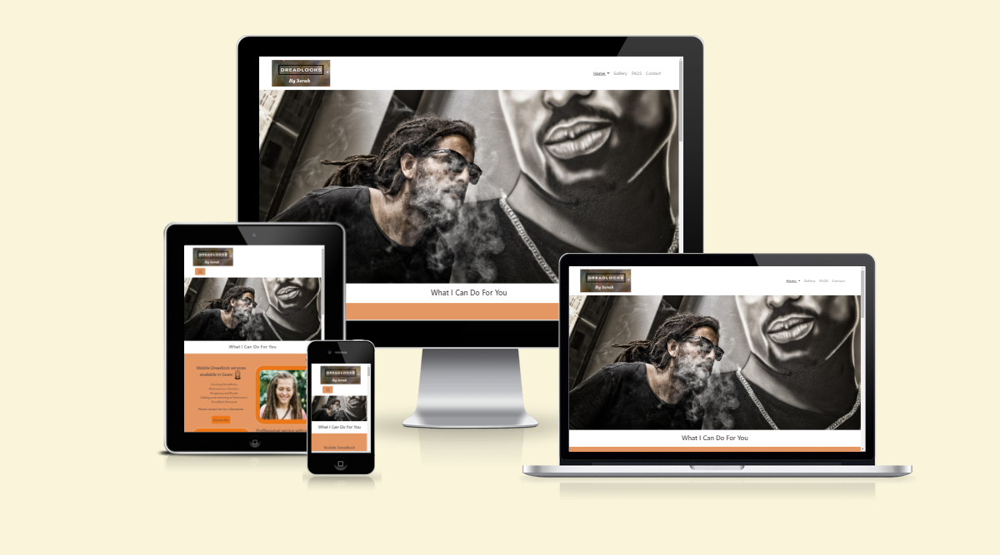

# User Stories
## New Site Users
- As a new site user, I would like to get information and advice , so that I can Decide wether this service is right for me. 

- As a new site user, I would like to see example work portfolio, so that I can see the qaulity of previous jobs taken. 

- As a new site user, I would like to understand the process of obtaining dreadlocks and the maintainance they require, so that I can decide wether dreadlocks are for me. 

- As a new site user, I would like to see the simplicity in making an appointment, so that I can go ahead and request services. 

- As a new site user, I would like to be able to locate the relevant content with ease  , so that I can move through the site freely finding the information I need. 

## Returning Site Users 

- As a returning site user, I would like to be able to find after appointment care advice, So that I can keep hair healthy and maintained until next appointment. 

- As a returning site user, I would like to check the before appointment care advice, So that I can prepare for my appointment. 

- As a returning user to the site, I would like to make contact with an after care querie.

- As a returning user to the site, I would like to book a maintainance appointment.

## Site Admin 

- As a site administrator, I should be able to provide the basic information needed, so that I can take less time dealing with general queries. 

- As a site administrator, I should be able to collect customer data to use for future marketing.

- As a site administrator, I should be able to showcase my work. 

- As a site administrator, I should be able to make my services known to potential customers.

# Design
A sharp free flowing design with engaging imagery and call to actions were felt nessacerry to catch the users attention. Information provided in small sections to not loose user attention. Bright bold colours to keep the user engaged.

## Colour Scheme
Most locticians use  black gold and green to relate to the Jamacan culture of dreadlocks. How ever as a business that caters for all races and hair types we wanted to keep the theme natural and earthy hence the choice of slate, brown and oranges. I used [adobe color wheel](https://color.adobe.com/create/color-wheel) to create my colour scheme.
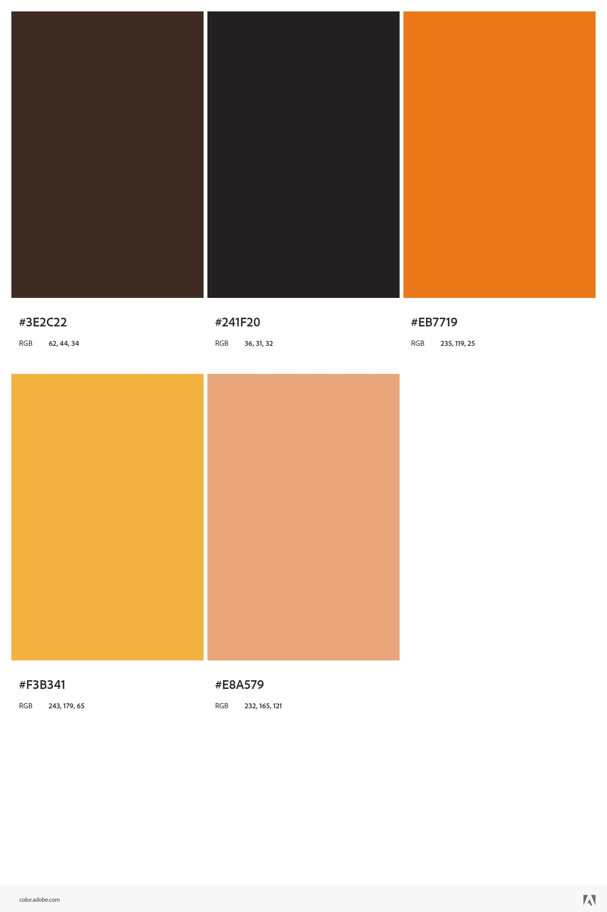
- 3E2C22 was used for text
- 241F20 Was used for headings
- E8A579 & F3B341 Used as Background colours
- EB7719 Used for call to actions and some image borders

## Typography
I have chosen to use Roboto as my preffered font as it is easy to read on all screen sizes. I used Verdana as the websafe font this is due to it being designed for monitors, having distinctive letter forms that help avoid confusion. Sans Serif was used as the fallback font due to it being generic.
The Roboto font was exported from [Google fonts](https://fonts.google.com/specimen/Roboto).

Icons used were from [Font Awesome](https://fontawesome.com) and [Adobe Stock](https://stock.adobe.com/)

# wireframes
To follow best practice , Wireframes were developed for mobile, tablet and desktop sizes

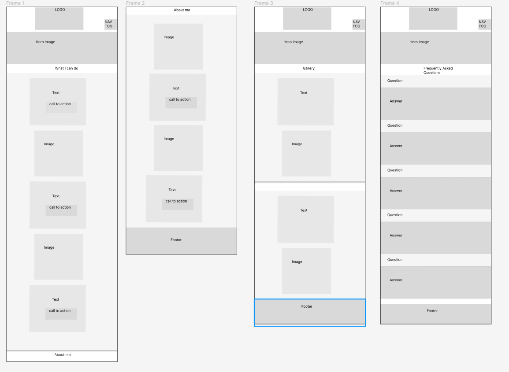

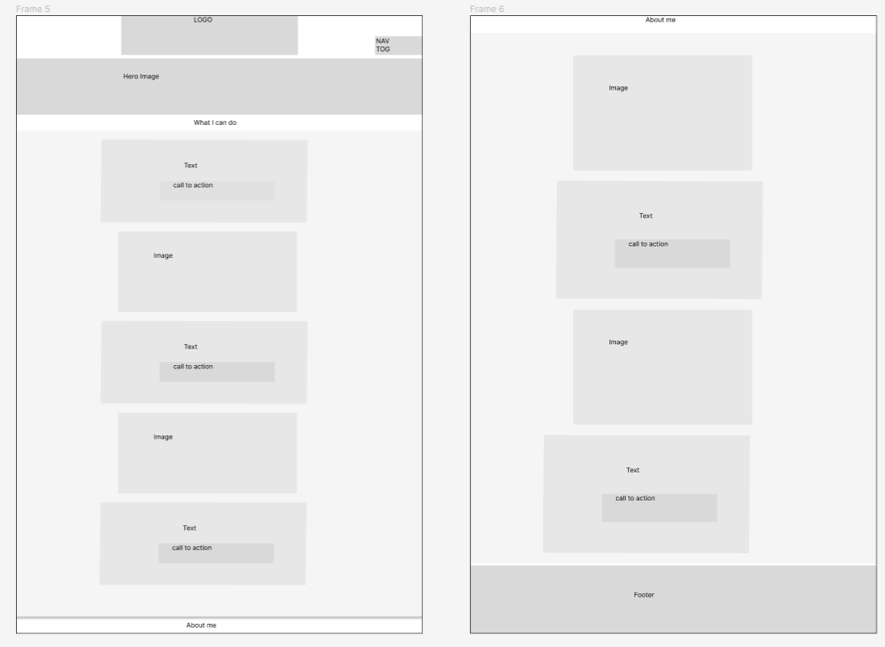

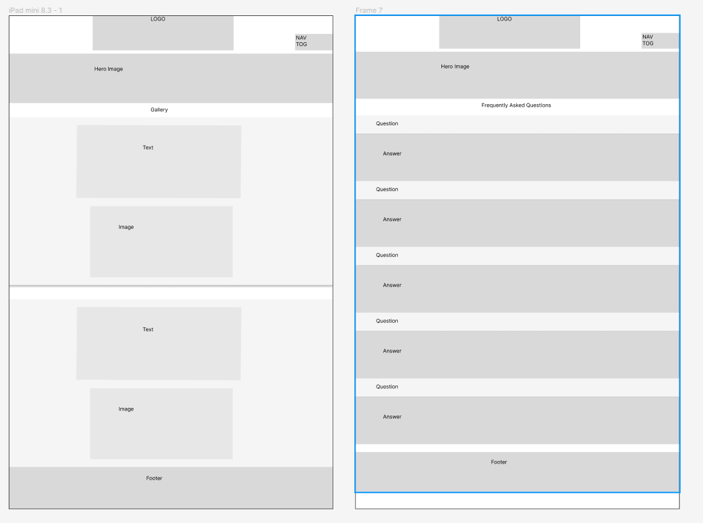

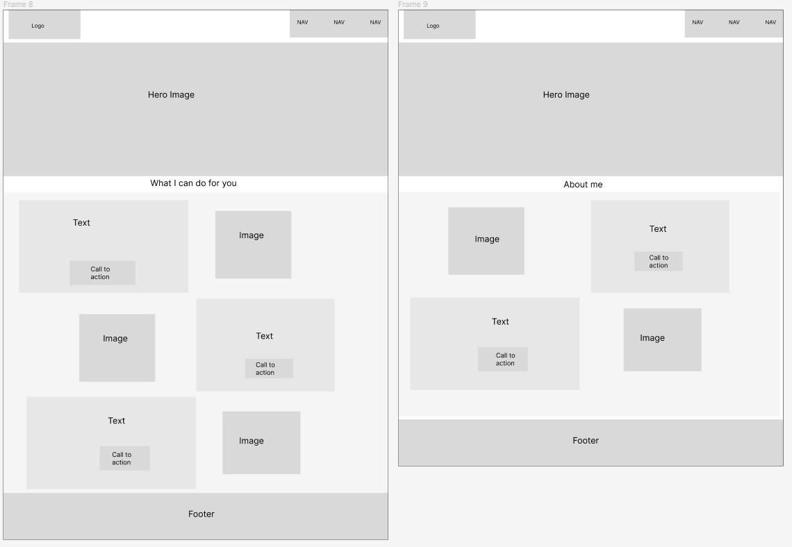

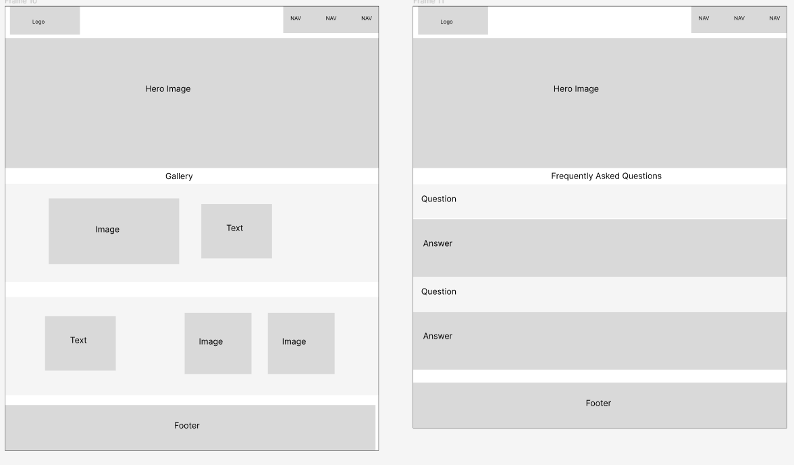

# High Fidelity  Prototype
I used [Figma](www.figma.com) to create high fidelity prototypes for mobile, tablet and desktop devices.

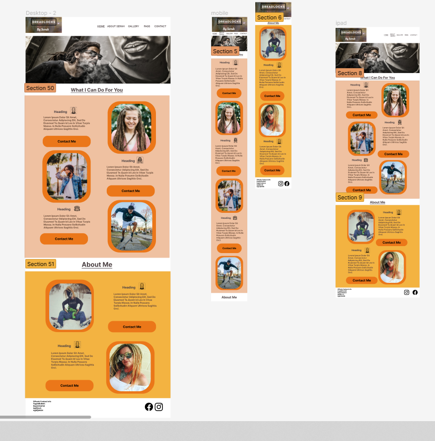

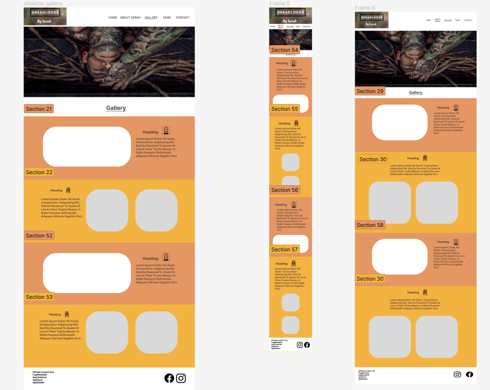

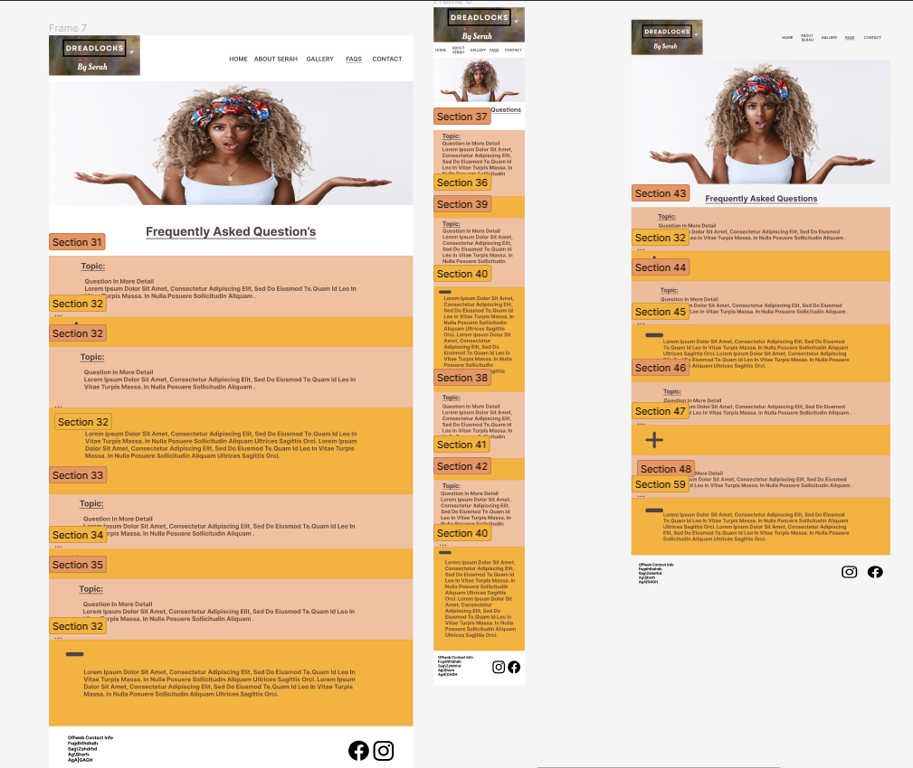

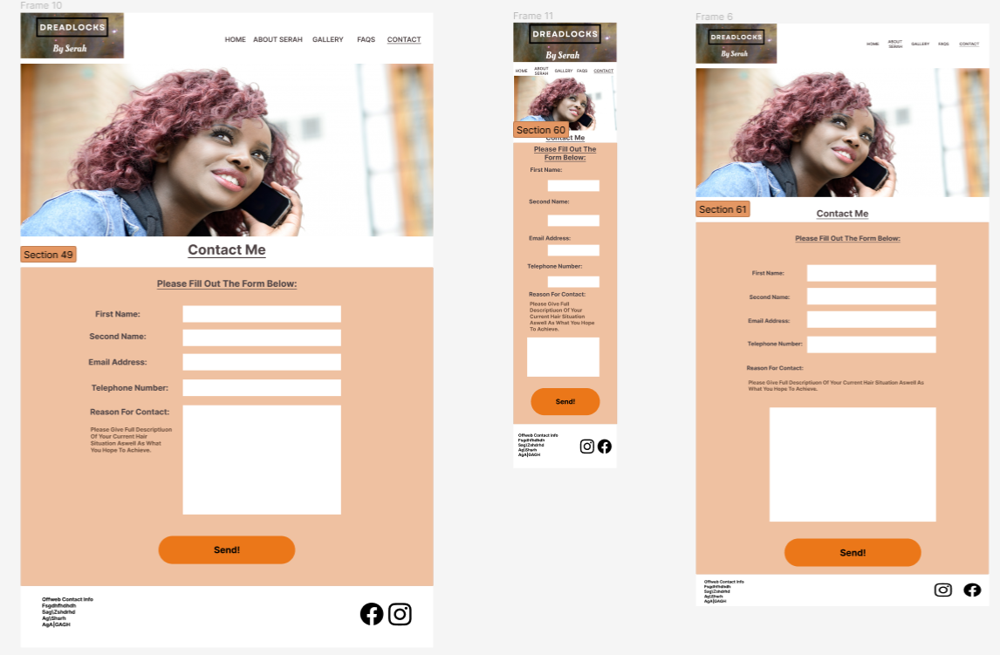

# Features
 The website consists of 4 pages, The index page is split into 2 pages consisting of "what I can Do for you" and "About me". It also has a gallery and a frequently asked questions page. I also added an overlay modal which displays a contact form when a contact button/link is actioned.

 # General Features
 ## Header
  The Header is responsive to all screen sizes. On large screens it expands horzontally, while on smaller screens the nav bar is replaced with a burger icon. Clicking this icon would make nav bar dropdown menu appear. There is also a seperate drop down menu that is accessed when clicking the home link this displays the options for each section of the page. The Nav bar is from [Bootstrap](https://getbootstrap.com/) and then customised by myself.

  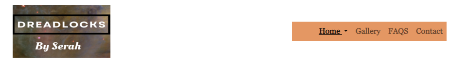
  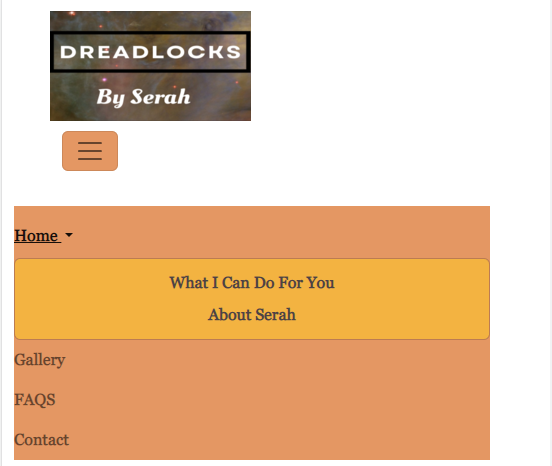

  ## Footer
 The footer features contact information as well as icons linking to social media pages.
 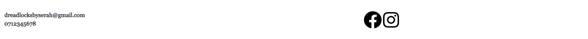
  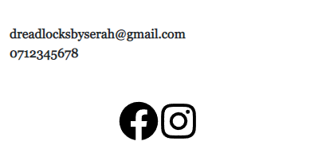

  ## Modals and Forms
  The Contact Me Modal is a pop-up actioned when the user selects a contact me button or Contact in the nav bar. The Modal is from [Bootstrap](https://getbootstrap.com/) and then customised by myself. The Form clearly displays which inputs are required or optional with placeholder text.

  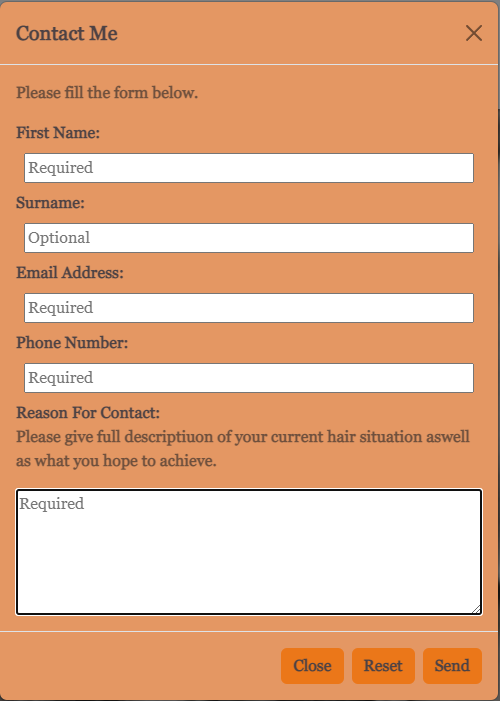

## Home Page 
The home page is where the services offered and credibility are advertised. This page offers information on the services available as well as on the person providing them. The home page also makes it very easy for the user to make contact should they wish too.

## Gallery
The gallery is where the user can find examples of previous work as well as other engaging content.
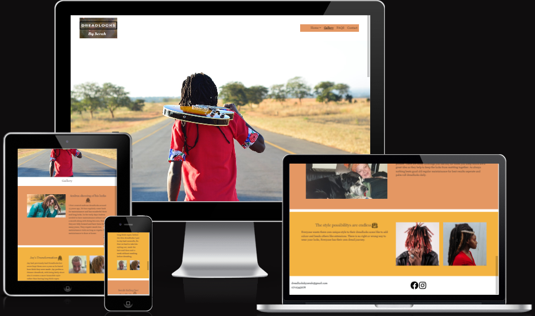

## Frequently Asked Questions
The FAQ Page is where the user can find the answers to the most common questions. The questions and answers are set in a [Bootstrap Accordion](https://getbootstrap.com/docs/5.0/components/accordion/) There is also a video iframe in this section which has great relatable content. Video from [Liz Kidder Studios On Youtube](https://www.youtube.com/@lizkidderstudio) 
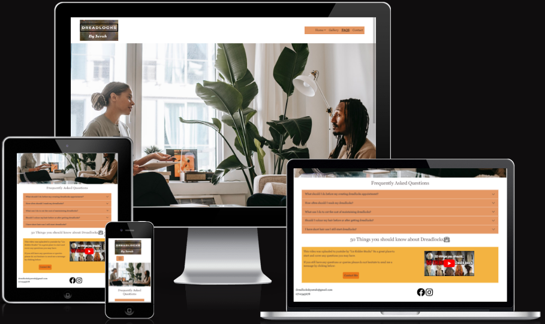

# Future Features

## Contact Modal
The modal needs to connect to a backend system to be functional and store the user data and requests.
I also think a seperate modal that opens when the user submits on the first modal thanking them would be a great addition.

## Gallery
More real live examples and case scenarios to be added to further proove authority in sector.

## FAQ
More questions to be covered, This can be looked at when customer queries are recieved and can be assesed to analyse the most needed for this section.

## Footer
Correct contact information to be added once set up by business owner.
Social media icons will link to direct page rather than the social media homepages, Once social media pages have been set up.

# Technologies Used

## Tools & Programs Used

- [Figma](https://www.figma.com/) Was Used for the wire frames and high fidelity prototypes.

- [Canva](https://www.canva.com/) Was used for logo creation.

- [Github](https://github.com/) & [Gitpod](https://gitpod.io/) For version control, Safe storage and Deployment. Web based IDE.

- [Codeanywhere](https://app.codeanywhere.com/) Was used as a web based IDE.

- [Google Dev Tools](https://developer.chrome.com/docs/devtools/) For testing and troubleshooting.

- [Gimp](https://www.gimp.org/) For Image Manipulation(Resizing,converting file type etc.)

- [Bootstrap](https://getbootstrap.com/) was used accross the design including Grid, Modal, Brand Nav Bar.

- [Adobe Color Wheel](https://color.adobe.com/create/color-wheel) For colour theme.

- [Lorem Ipsum](https://loremipsum.io/) Was used for place holder text in the earlier design stage.

- [Google Fonts](https://fonts.google.com/) Was used to import font.

- [Am I Responsive?](https://ui.dev/amiresponsive?url=https://jaycode88.github.io/msp-1) To Create visuals for responsive design.

- [ChatGPT](https://chat.openai.com/) Was used for trouble shooting.

- [W3 HTML Validator](https://validator.w3.org/) Was used to validate HTML.

- [W3 Jigsaw CSS Validator](https://jigsaw.w3.org/css-validator/) Was used to Validate CSS.

- [AY11 Colour Contrast](https://color.a11y.com/Contrast/) Was used to test colour contrast.

# Testing

For all testing, Please refer to the [TESTING.md](TESTING.md) File

# Deployment
The site was deployed to GitHub Pages. The steps to deploy are as follows: 

- In the [GitHub repository](https://github.com/Jaycode88/msp-1), navigate to the Settings tab  

- From the source section drop-down menu, select the **Main** Branch, then click "Save". 

- The page will be automatically refreshed with a detailed ribbon display to indicate the successful deployment. 

  

The live link can be found [here](https://jaycode88.github.io/msp-1) 

## Local Deployment
This project can be cloned or forked in order to make a local copy on your own system.

## Cloning
You can clone the repository by following these steps: 

1. Go to the [GitHub repository](https://github.com/Jaycode88/msp-1)  

2. Locate the Code button above the list of files and click it  

3. Select if you prefer to clone using HTTPS, SSH, or GitHub CLI and click the copy button to copy the URL to your clipboard 

4. Open Git Bash or Terminal 

5. Change the current working directory to the one where you want the cloned directory 

6. In your IDE Terminal, type the following command to clone my repository: 

- `git clone https://github.com/Jaycode HYPERLINK "https://github.com/Jaycode88/msp-1.git%60"88 HYPERLINK "https://github.com/Jaycode88/msp-1.git%60"/msp- HYPERLINK "https://github.com/Jaycode88/msp-1.git%60"1 HYPERLINK "https://github.com/Jaycode88/msp-1.git%60".git` 

7. Press Enter to create your local clone. 

  

Alternatively, if using Gitpod, you can click below to create your own workspace using this repository. 

  

 

  

Please note that in order to directly open the project in Gitpod, you need to have the browser extension installed. 

A tutorial on how to do that can be found [here](https://www.gitpod.io/docs/configure/user-settings/browser-extension). 

## Forking
By forking the GitHub Repository, we make a copy of the original repository on our GitHub account to view and/or make changes without affecting the original owner's repository. 

You can fork this repository by using the following steps: 

  

1. Log in to GitHub and locate the [GitHub Repository](https://github.com/Jaycode88/msp-1) 

2. At the top of the Repository (not top of page) just above the "Settings" Button on the menu, locate the "Fork" Button. 

3. Once clicked, you should now have a copy of the original repository in your own GitHub account! 

# Credits

## Images

Most Images are from [Pexels](https://www.pexels.com/).

A Select few images of myself and Serah are from personal collection.

### Index Hero Image

- From Mali Maeder on [Pexels](https://www.pexels.com/photo/man-with-dreadlocks-and-sunglasses-poses-near-tupac-shakur-portrait-802195/).

### What I Can Do For You Images
- Woman Smiling From Fauxels on [Pexels](https://www.pexels.com/photo/shallow-focus-photo-of-woman-smiling-3228904/)

- Man in sunshine from Caleb Oquendo on [Pexels](https://www.pexels.com/photo/standing-man-wearing-blue-denim-jacket-3038287/)

- Man on Skateboard From Hussein Altameemi on [Pexels](https://www.pexels.com/photo/man-doing-skateboard-stunt-1764506/)

### About Me Images

- From Personal Collection.

### Gallery Hero Image

- From Keith wako on [Pexels](https://www.pexels.com/photo/person-in-pink-t-shirt-holding-brown-electric-guitar-walking-on-blacktop-road-during-daytime-89907/).

### Other Gallery Images

- Andrea's Image is from Andrea Bova on [Pexels](https://www.pexels.com/photo/man-in-denim-jacket-and-brown-pants-2479694/).

- Jay's Images is from Personal collection.

- Serah And Rocket's Image is from personal collection.

- The man with the read Dreadlocks is from Cheef Coca from [Pexels](https://www.pexels.com/photo/man-covering-his-mouth-2080736/).

- Lady with long Dreadlocks is from Asiama Junior on [Pexels](https://www.pexels.com/photo/thoughtful-young-black-woman-with-dreadlocks-looking-away-against-weathered-wall-6567601/).

### FAQ Hero Image

- From Alex Green On [Pexels](https://www.pexels.com/photo/overwhelmed-black-man-discussing-problem-with-female-psychologist-5699467/).

### FAQ Iframe Video

- From Liz Kidder Studio On [Youtube](https://www.youtube.com/watch?v=5D-2VhG01cc&t=7s).

## Icons
- Social Media Icons from [FontAwesome](https://fontawesome.com/search?o=r&m=free).

- Other Icons from [Adobe Stock](https://stock.adobe.com/).

## Other Credits

- To [CodeInstitute](https://learn.codeinstitute.net/) for the Template And course content.

- Tutors and Lecturers at [City Of Bristol College](https://www.cityofbristol.ac.uk/).

- The whole community on [Slack](https://slack.com/intl/en-gb).

- My Code Institute Mentor.

## Content

 I wrote all content myself how ever I did take inspiration from the typed adds at [Dreads.co.uk](https://www.dreadz.co.uk/pages/uk-dreading-services-companies-and-dreadlock-maintenance-salons#Essex).

 # Acknowledgements

 - The freinds that helped to test the site.

 - My code Institute Mentor

 - My City of bristol college Lecturer