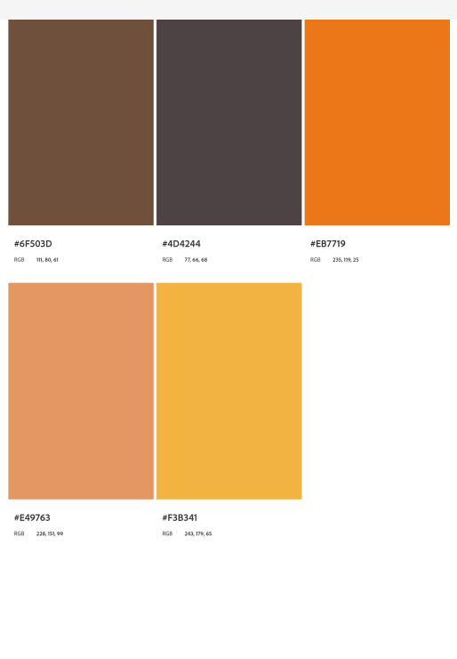

# Dreadlocks By Serah Msp1 

This is a site built for a real world business. Dreadlocks by Serah offer a mobile loctician service. The site gives visitors and users an overview of the services offered and plenty of opportunity to make contact. The site also has an FAQ section to cover the most common queries and A gallery to show case previous work. 

# Design
Breifly explain design process

## Colour Scheme
Most locticians use  black gold and green to relate to the Jamacan culture of dreadlocks. How ever as a business that caters for all races and hair types we wanted to keep the theme natural and earthy hence the choice of slate, brown and oranges. I used [adobe color wheel](https://color.adobe.com/create/color-wheel) to create my colour scheme.

- 6F503D was used for text
- 4D4244 Was used for headings
- E49763 & F3B341 Used as Background colours
- EB7719 Used for call to actions and some image borders

# Typography
I chose to use Georgia as my preffered font as it is easy to read and maintains a proffesional appearance. I used Verdana as the websafe font this is due to it being designed for monitors, having distinctive letter forms thst help avoid confusion. Sans Serif was used as the fallback font due to it being generic.
The georgia font was exported from [Cdnfonts](https://www.cdnfonts.com/).

Icons used were from [Font Awesome](https://fontawesome.com) and [Adobe Stock](https://stock.adobe.com/)

# User Stories
## New Site Users
- As a new site user, I would like to get information and advice , so that I can Decide wether this service is right for me. 

- As a new site user, I would like to see example work portffolio, so that I can see the qaulity of previous jobs taken. 

- As a new site user, I would like to understand the process of obtaining dreadlocks and the maintainance they require, so that I can decide wether dreadlocks are for me. 

- As a new site user, I would like to see the simplicity in making an appointment, so that I can go ahead and request services. 

- As a new site user, I would like to be able to locate the relevant content with ease  , so that I can move through the site freely finding what the information I need. 

## Returning Site Users 

- As a returning site user, I would like to be able to find after appointment care advice, So that I can keep the healthy and maintained until next appointment. 

- As a returning site user, I would like to check the before appointment care advice, So that I can prepare for my appointment. 

- As a returning user to the site, I would like to contact with an after care querie.

- As a returning user to the site, I would like to book a maintainance appointment.

## Site Admin 

- As a site administrator, I should be able to provide the basic information needed, so that I can take less time dealing with general queries. 

- As a site administrator, I should be able to collect customer data to use for future marketing.

- As a site administrator, I should be able to showcase my work. 

- As a site administrator, I should be able to make my services known to potential customers.

# wireframes
To follow best practice , Wireframes were developed for mobile, tablet and desktop sizes

# High Fidelity  Prototype
I used [Figma](www.figma.com) to create high fidelity prototypes for mobile, tablet and desktop devices.

# Features
 The website consists of 4 pages, The index page is split into 2 pages consisting of "what I can Do for you" and "About me". It also has a gallery and a frequently asked questions page. I also added an overlay modal which displays a contact form when a contact button/link is actioned.

 # General Features
 ## Header
  The Header is responsive to all screen sizes. On large screens it expands horzontally, while on smaller screens the menu bar is replaced with a burger icon. Clicking this icon would make nav bar dropdown menu appear. There is also a seperate drop down menu that is accessed when clicking the home link this displays the options for each section of the page.The Nav bar is from [Bootstrap](https://getbootstrap.com/) and then customised by myself.

  
  

  ## Footer
 The footer features contact information as well as icons linking to social media pages.
 
  

  ## Modals and Forms
  The Contact Me Modal is a pop-up actioned when the user selects a contact me button or Contact in the nav bar. The Modal is from [Bootstrap](https://getbootstrap.com/) and then customised by myself. The Form clearly displays which inputs are required or optional with placeholder text.
  

## Home Page 
The home page is where the services offered and credibility are advertised. This page offers information on the services available as well as on the person providing them. The home page also makes it very easy for the user to make contact should they wish too.

## Gallery
The gallery is where the user can find examples of previous work as well as other engaging content.

## Frequently Asked Questions
The FAQ Page is where the user can find the answers to the most common questions. There is also a video iframe in this section which has great relatable content. Video from [Liz Kidder Studios On Youtube](https://www.youtube.com/@lizkidderstudio) 

# Future Features

## Contact Modal
The modal needs to conect to a backend system to be functional and store the user data and requests.
I also think a seperate modal that opens when the user submits on the first modal thanking them would be a great addition.

## Gallery
More real live examples and case scenarios to be added to further proove authority in sector.

## FAQ
More questions to be covered, This can be looked at when customer queries are recieved and can be assesed to analyse the most needed for this section.

## Footer
Correct contact information to be added once set up by business owner.
Social media icons will link to direct page rather than the social media homepages, Once social media pages have been set up.

# Technologies Used

## Tools & Programs Used

- [Figma](https://www.figma.com/) Was Used for the wire frames and high fidelity prototypes.

- [Canva](https://www.canva.com/) Was used for logo creation.

- [Github](https://github.com/) & [Gitpod](https://gitpod.io/) For version control, Safe storage and Deployment. Web based IDE.

- [Google Dev Tools](https://developer.chrome.com/docs/devtools/) For testing and troubleshooting.

- [Gimp](https://www.gimp.org/) For Image Manipulation(Resizing,converting file type etc.)

- [Bootstrap](https://getbootstrap.com/) was used accross the design including Grid, Modal, Brand Nav Bar.

- [Adobe Color Wheel](https://color.adobe.com/create/color-wheel) For colour theme.

- [Lorem Ipsum](https://loremipsum.io/) Was used for place holder text in the earlier design stage.

- [CDN Fonts](https://www.cdnfonts.com/) Was used to import font.

- [Am I Responsive?](https://ui.dev/amiresponsive?url=https://jaycode88.github.io/msp-1) To Create visuals for responsive design.

- [ChatGPT](https://chat.openai.com/) Was used for trouble shooting.
