# Testing

Return back to the [README.md](README.md)

I have used various tools to Test Funcionality, Validity and responsiveness.
I have been sure to check all layouts, colours, text, forms, links, buttons are functioning on all devices and screen sizes that I have tested.

## Code Validation

### HTML

I have used the recommended [HTML W3C Validator](https://validator.w3.org) to validate Each of my HTML files.

[Index Test Result](https://validator.w3.org/nu/?doc=https%3A%2F%2Fjaycode88.github.io%2Fmsp-1%2F)

[Gallery Test Result](https://validator.w3.org/nu/?doc=https%3A%2F%2Fjaycode88.github.io%2Fmsp-1%2Fgallery.html)

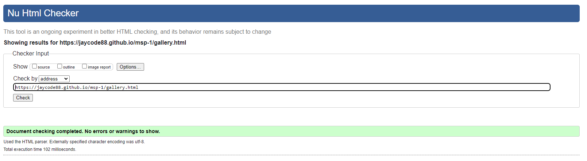

[FAQ Test Result](https://validator.w3.org/nu/?doc=https%3A%2F%2Fjaycode88.github.io%2Fmsp-1%2Ffaq.html)

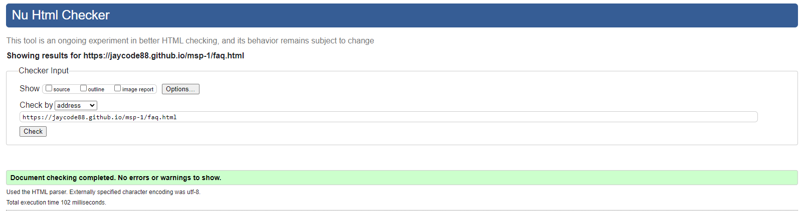

### CSS

I have used the recommended [CSS Jigsaw Validator](https://jigsaw.w3.org/css-validator) to validate all of my CSS files.

There are errors shown, But these are all due to third party applications. All CSS code entered by myself is validated.

[CSS Test Results](https://jigsaw.w3.org/css-validator/validator?uri=https%3A%2F%2Fjaycode88.github.io%2Fmsp-1%2F&profile=css3svg&usermedium=all&warning=1&vextwarning=&lang=en#errors)

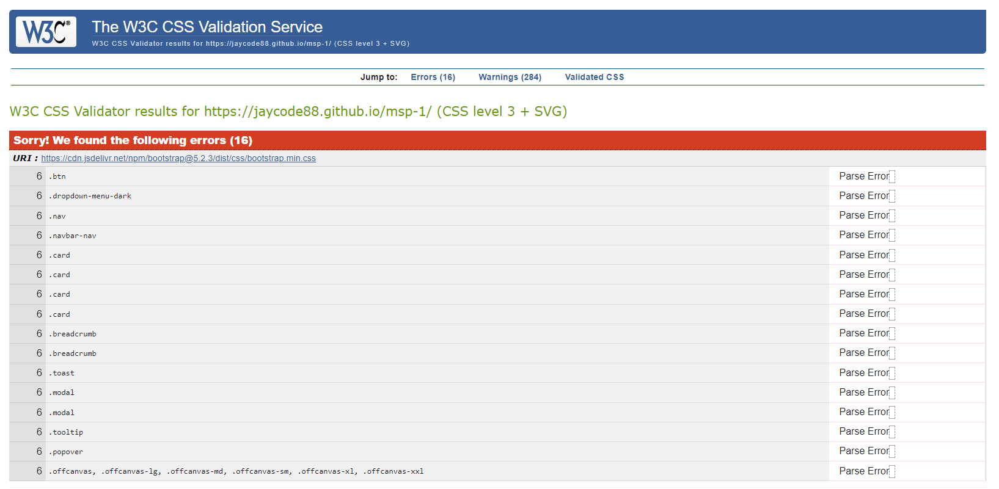

## Browser Capability

I have tested my deployed project on multiple browsers to check for compatibility issues.

| Browser | Page/Form | Expected Look | Expected Behaviour |
|---------|-----------|---------------|--------------------|
|  Chrome |   Index   |        Y      |          Y         |
|         |  Gallery  |        Y      |          Y         |
|         |    FAQ    |        Y      |          Y         |
|         |   Modal   |        Y      |          Y         |
| Firefox |   Index   |        Y      |          Y         |
|         |  Gallery  |        Y      |          Y         |
|         |    FAQ    |        Y      |          Y         |
|         |   Modal   |        Y      |          Y         |
|  Edge   |   Index   |        Y      |          Y         |
|         |  Gallery  |        Y      |          Y         |
|         |    FAQ    |        Y      |          Y         |
|         |   Modal   |        Y      |          Y         |
|  Opera  |   Index   |        Y      |          Y         |
|         |  Gallery  |        Y      |          Y         |
|         |    FAQ    |        Y      |          Y         |
|         |   Modal   |        Y      |          Y         |

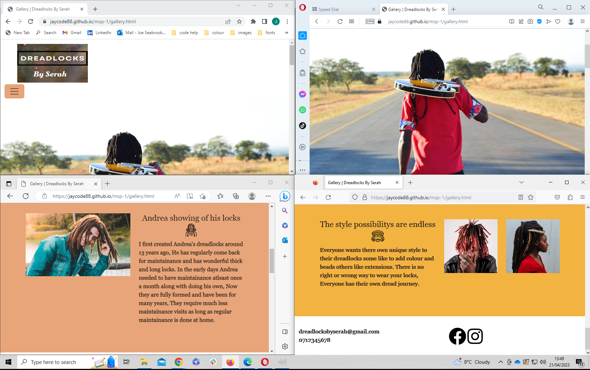

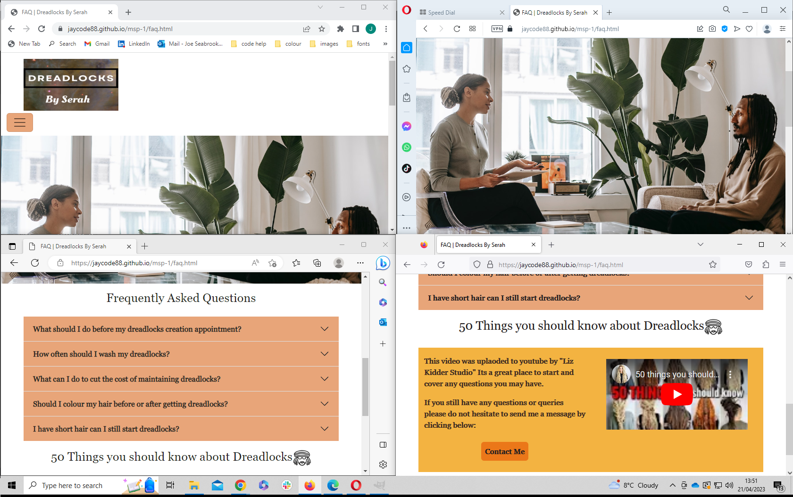

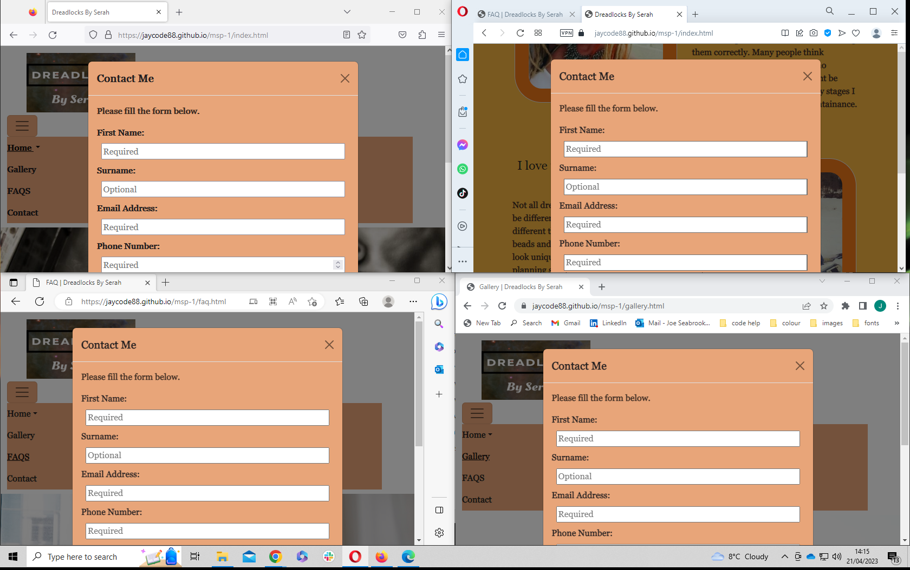

## Responsiveness

I've tested my deployed project on multiple devices to check for responsiveness issues. 

| Device    | Page/Form | Expected Look |
|-----------|-----------|---------------|
|Desktop 22"| Index     | Y             |
|           | Gallery   | Y             |
|           | FAQ       | Y             |
|           | Modal     | Y             |
|Laptop 16" | Index     | Y             |
|           | Gallery   | Y             |
|           | FAQ       | Y             |
|           | Modal     | Y             |
| Iphone 13 | Index     | Y             |
|           | Gallery   | Y             |
|           | FAQ       | Y             |
|           | Modal     | Y             |
|Galaxy S20 | Index     | Y             |
|           | Gallery   | Y             |
|           | FAQ       | Y             |
|           | Modal     | Y             |
|Tablet     |Index     | Y             |
|           | Gallery   | Y             |
|           | FAQ       | Y             |
|           | Modal     | Y             |

### Desktop

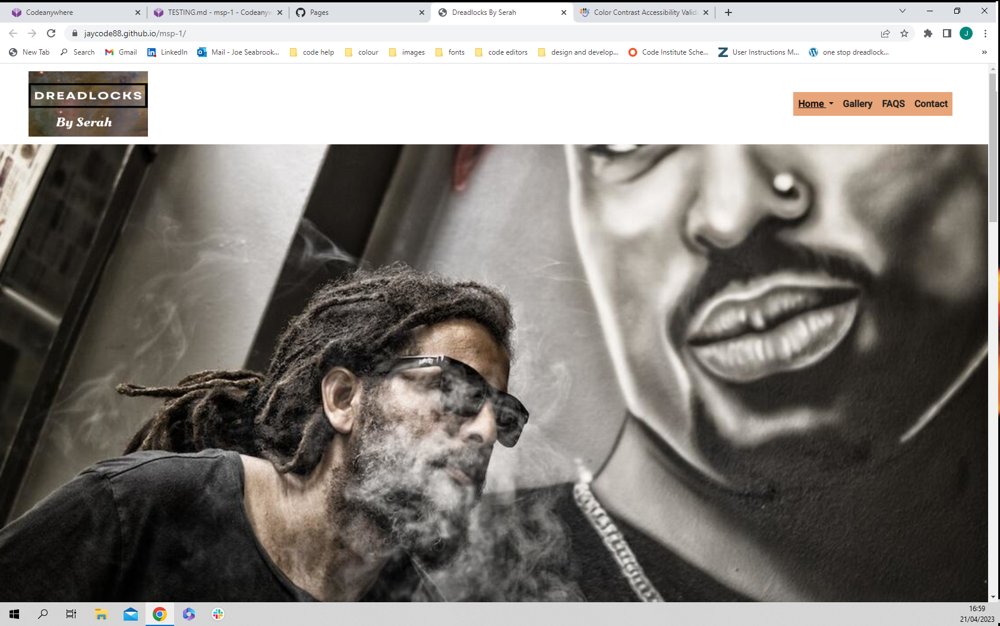

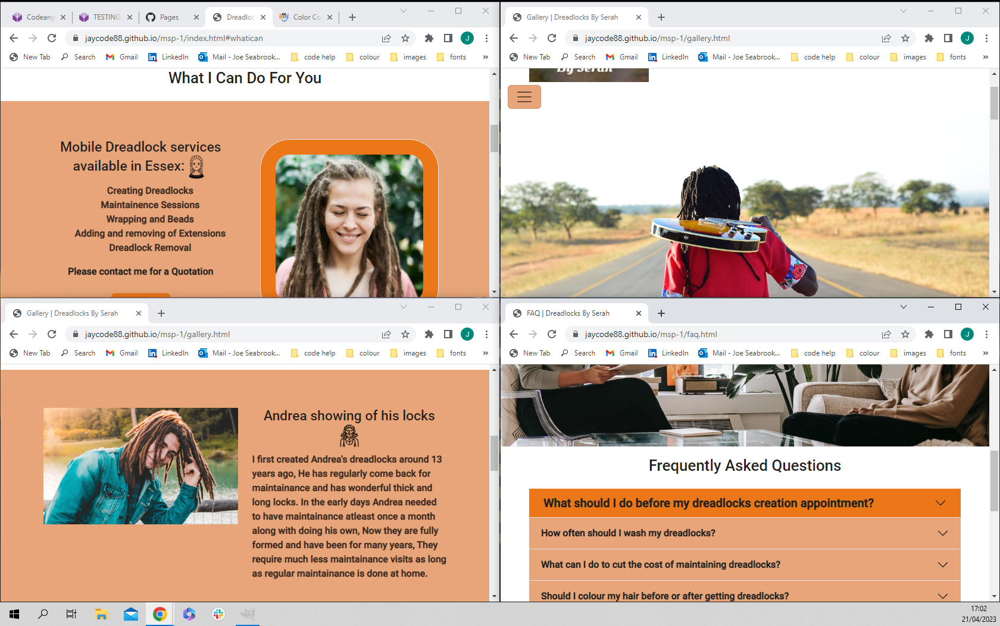

### Tablet

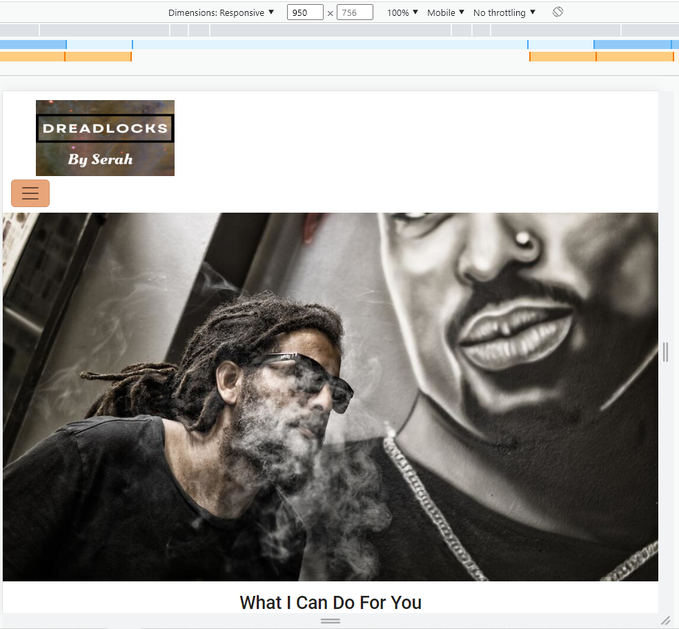

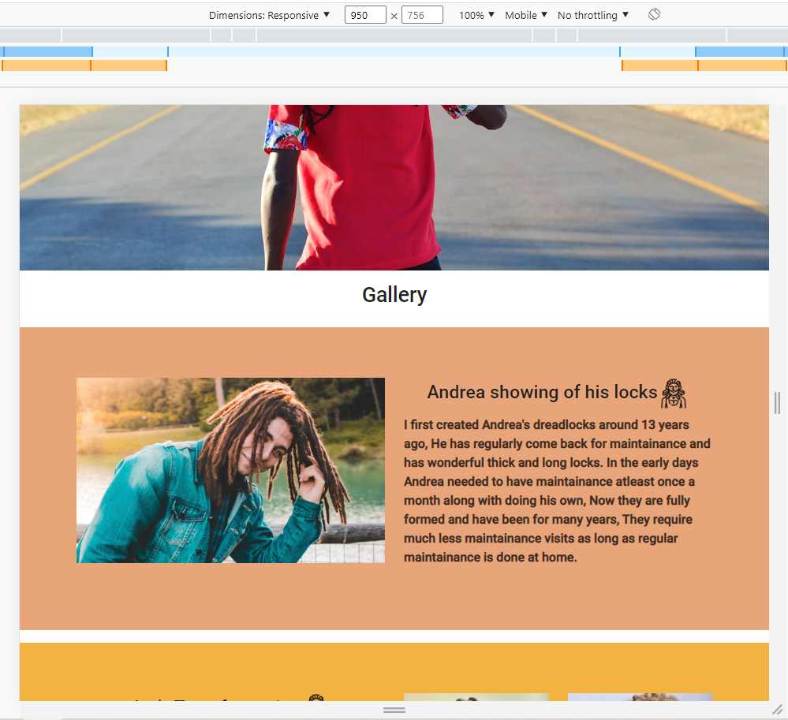

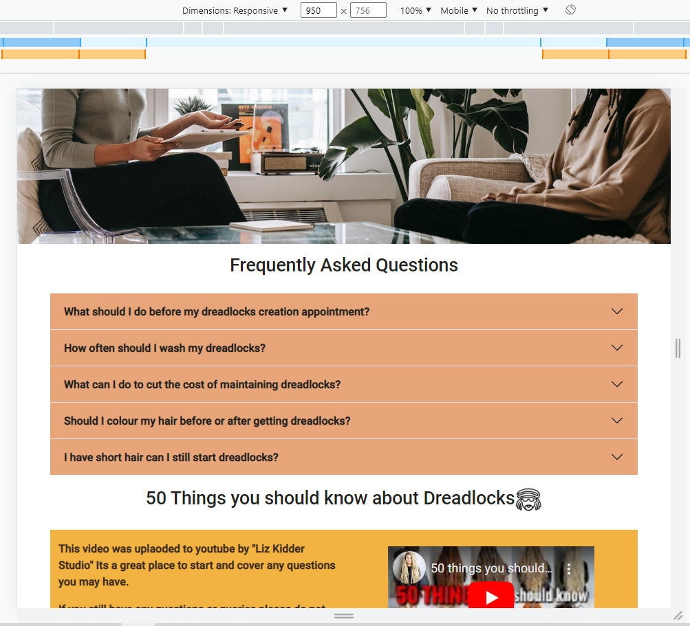

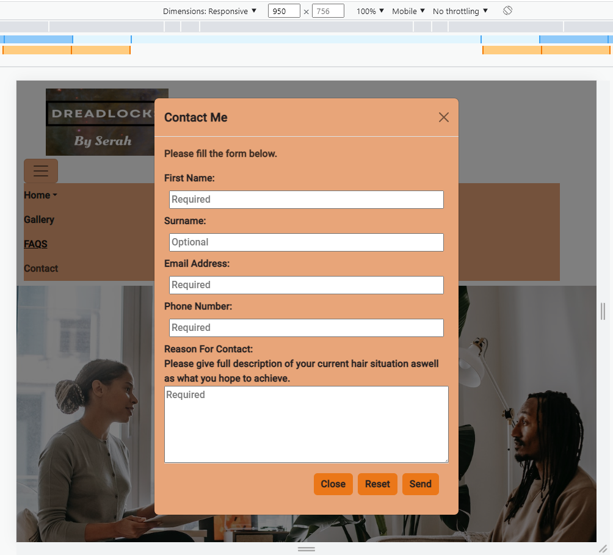

### Mobile

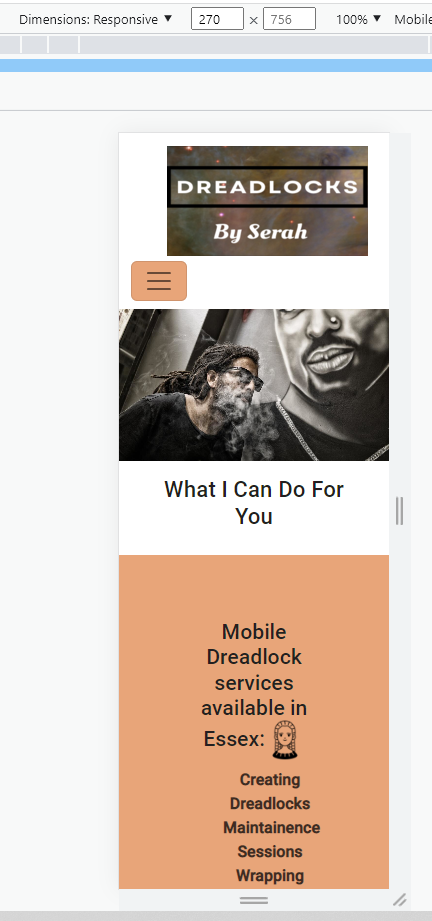

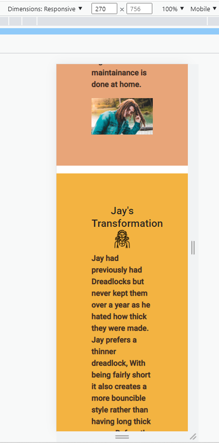

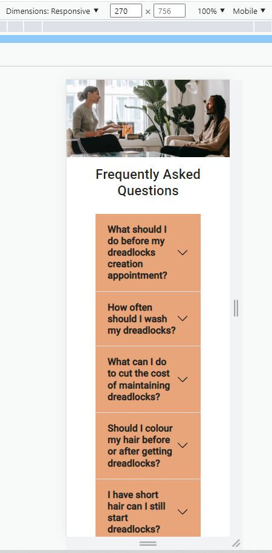

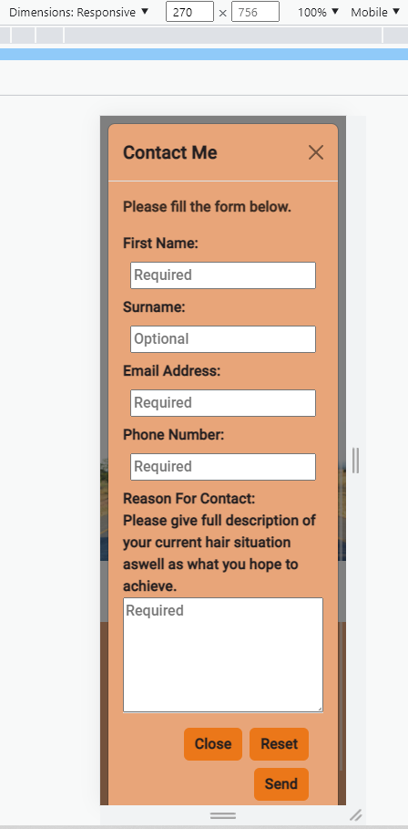

Responsiveness was tested using [Google Dev Tools](https://developer.chrome.com/docs/devtools/) As well as my personal devices.

## Lighthouse Audit

I've tested my deployed project using the Lighthouse Audit tool to check for any major issues. 

### Index

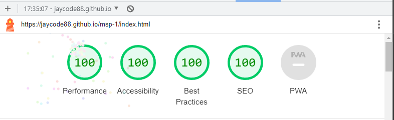

### Gallery

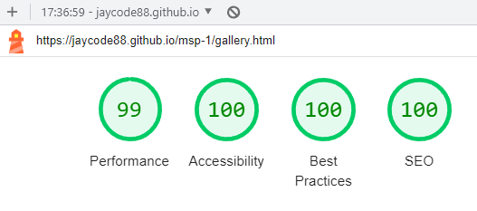

### FAQ  

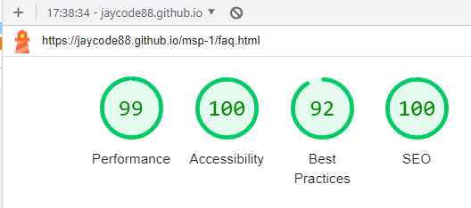

## User Story Testing

| User Story                                                | Screenshot                        | Notes |
|-----------------------------------------------------------|-----------------------------------|-------|
|As a new site user, I would like to get information and advice, so that I can Decide wether this service is right for me. |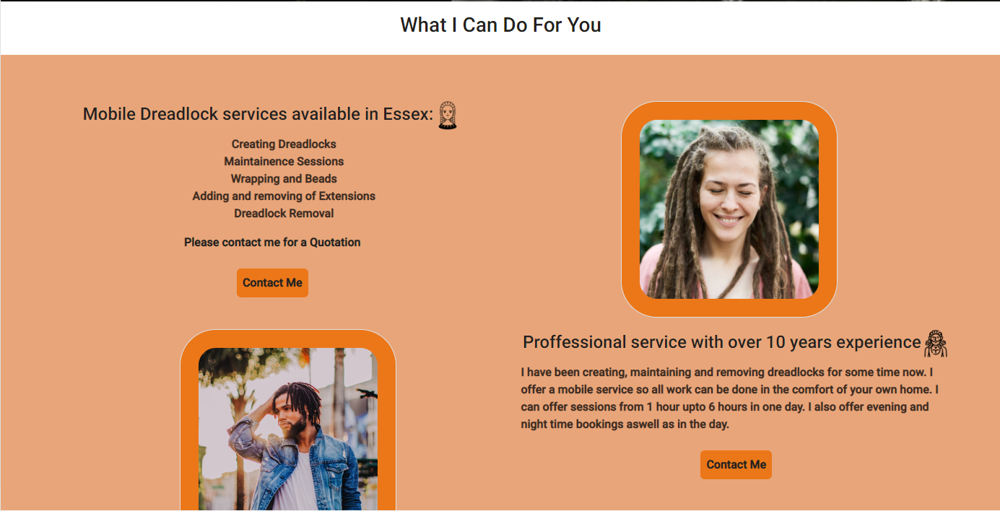|Website displays plenty of info regarding services available|
|As a new site user, I would like to see example work portfolio, so that I can see the qaulity of previous jobs taken.|  | Gallery hosts images of previous work.|
|As a new site user, I would like to understand the process of obtaining dreadlocks and the maintainance they require, so that I can decide wether dreadlocks are for me.|| The site conatains lots of information regarding dreadlocks the FAQ being the hub of informattion including a video.|
|As a new site user, I would like to see the simplicity in making an appointment, so that I can go ahead and request services.||There are multiple contact buttons around the site that open an easy to fill form to submit. there is also contact information and social media links in the footer bar.|
|As a new site user, I would like to be able to locate the relevant content with ease , so that I can move through the site freely finding the information I need.|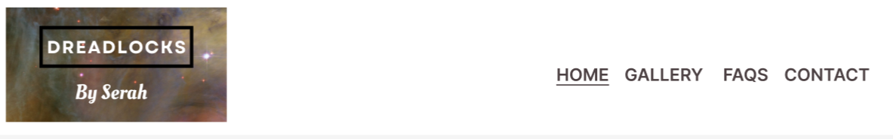 | Easy to use nav bar for navigation.|
|As a returning site user, I would like to be able to find after appointment care advice, So that I can keep hair healthy and maintained until next appointment.| | FAQ section as well as the option to make contact.|
|As a returning user to the site, I would like to make contact with an after care querie or book a maintainance appointment.| |Pop up modal with plenty of links around site to action.|
|As a site administrator, I should be able to provide the basic information needed, so that I can take less time dealing with general queries.||FAQ Hub of information other pages also provide useful relevant information|
|As a site administrator, I should be able to collect customer data to use for future marketing.|| Form will collect information once back end built.|
|As a site administrator, I should be able to showcase my work.||Gallery is a page dedicated to photos of previous work.|
|As a site administrator, I should be able to make my services known to potential customers.|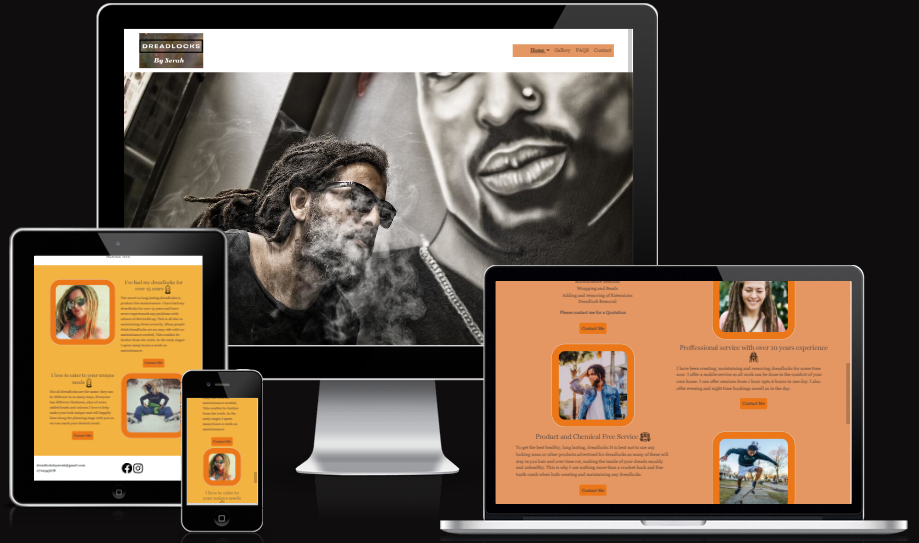| The index page highlights the services available as well as the site hosting a lot of information. The site's description in the <head> section makes the organisation's work clear for search engines.|

## Bugs

### Known Bugs

- There is a blue highlight affecting the arrow and around the question box section when clicked. This is due to using the [Bootstrap Accordian](https://getbootstrap.com/docs/5.0/components/accordion/). I have not been unable to remove it with doing a fair amount of internet research, I checked within the slack community as well as chatGPT. This does not affect functionality for the user but does not fit the colour theme.
